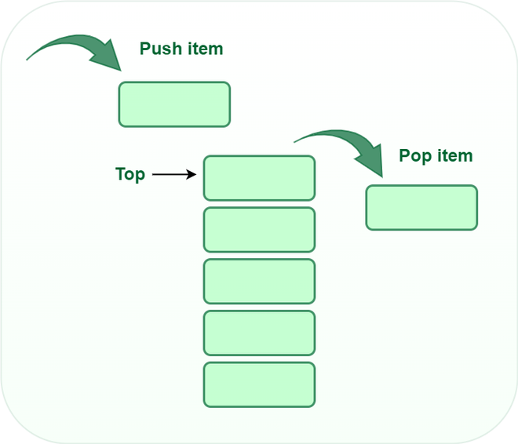

# Stack Data Structure in Java

## Introduction

A stack is a data structure that follows the Last In, First Out (LIFO) principle. In Java, the `Stack` class is available in the `java.util` package and extends the `Vector` class.

## Operations in Stack

* push() to insert an element into the stack
* pop() to remove an element from the stack
* top() Returns the top element of the stack.
* isEmpty() returns true if stack is empty else false.
* size() returns the size of stack.

# Stack Operations Time Complexity

| Operation  | Time Complexity |
|------------|-----------------|
| push()     | O(1)            |
| pop()      | O(1)            |
| isEmpty()  | O(1)            |
| size()     | O(1)            |

# Applications of the stack:
1. Expression Evaluation
2. Expression Conversion
   - Infix to Postfix
   - Infix to Prefix
   - Postfix to Infix
   - Prefix to Infix
3. Backtracking
4. Memory Management
5. Undo Mechanism in Software
6. Call Stack in Multithreading

# Implementation of Stack:
* Using array (fixed size)
* Using ArrayList (No size limit)
* Using linked list (No size limit)